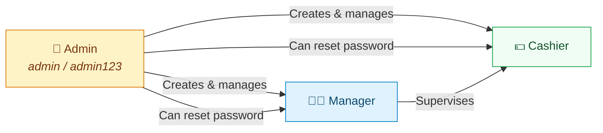
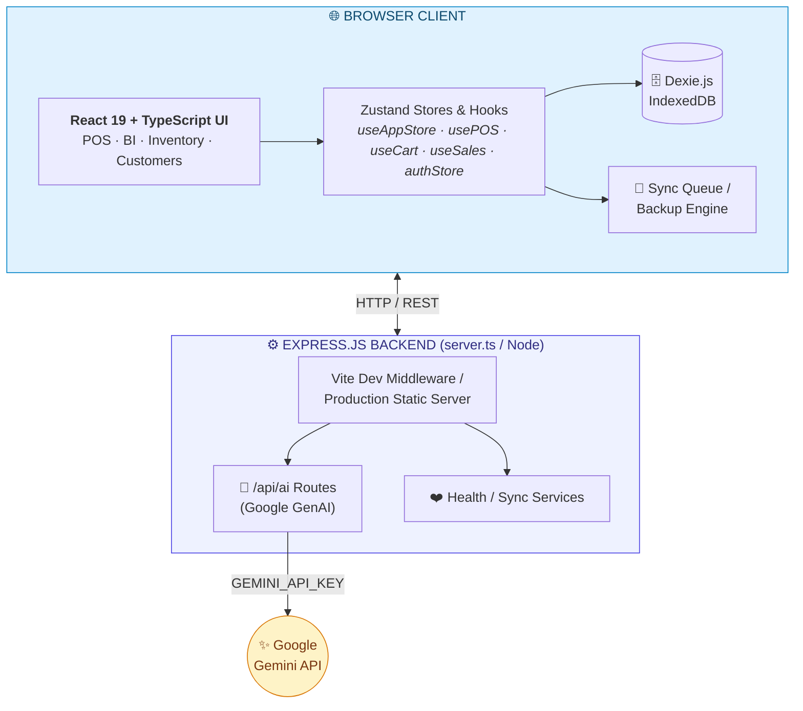
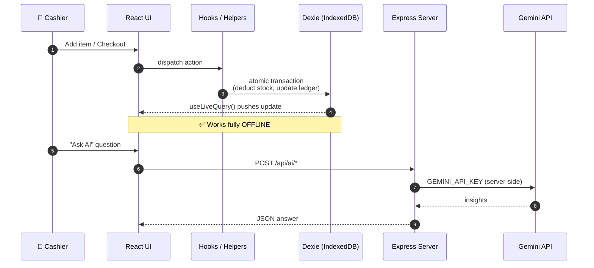

default user name And password
admin User name =  admin
password = admin123

admin can change password of manager and cashiers 


{{

BIG ONE

Respected Sir,

I hope this message finds you well.
I am truly excited to share with you my latest endeavor — a comprehensive University Management System, a large-scale project I have poured my heart and dedication into building.

This system is designed to bring an entire university ecosystem under one unified roof, seamlessly managing multiple campus buildings and departments. It encompasses a wide range of modules, including:

🎓 Students & Teachers – Complete profile & academic management

📚 Classes & Attendance – Smart scheduling & real-time tracking

📊 Results & Degrees – Automated grading & degree issuance

🔐 Admin & Super Admin – Multi-tier control & institutional oversight

It is, without a doubt, the most ambitious project I have undertaken so far — built to handle the full lifecycle of a modern educational institution from a single, centralized platform.

I would be deeply honored if you could spare a moment to review the project. Your experienced eyes would mean the world to me. I would also be truly grateful for any guidance, suggestions, or recommendations you could share — whether it's about architecture, features, or the direction I should take next.

Your mentorship has always been a guiding light, and your feedback on this project would help me grow even further.

Thank you so much for your time and continued support, Sir. 🙏

With sincere respect,
Akhtar ali
link= {   https://github.com/dagaiakhtar-ship-it/Final-project-2-University-Management-system         }


}}


<!-- =====================================================================
     🎨  SMART SHOP MANAGEMENT SYSTEM — GitHub README (v3)
     ---------------------------------------------------------------------
     ✅ All images use reliable hosts (Shields.io, placehold.co, GitHub
        user-attachments). Mermaid diagrams render natively on GitHub.
     
     🖼️  TO USE YOUR REAL SCREENSHOTS:
        Replace the placehold.co URLs with your asset paths:
        - Hero:        assets/pos-terminal.png
        - Dashboard:   assets/dashboard.png
        - Inventory:   assets/inventory.png
        - Customers:   assets/customers.png
===================================================================== -->

<div align="center">

# 🏪 Smart Shop Management System

### Offline‑First · AI‑Powered · Built for Real Business

An ultra‑speed, **offline‑first** Point of Sale terminal and comprehensive **Business Intelligence** suite — engineered with **React 19**, **TypeScript**, **Tailwind CSS v4**, **Dexie.js (IndexedDB)**, and **Google Gemini AI**.

> **This is not just an academic project — it is a real‑world system built to manage a real shop.**

<!-- Status badges -->


</div>

---

<!-- ============================  HERO  ============================ -->
<div align="center">


<sub>A tactile, keyboard‑driven cashier experience — live cart, multi‑payment checkout, instant product search.</sub>

</div>

---

<!-- ======================  TECH BADGES  ====================== -->
<div align="center">


<br/>


</div>

---

## 📖 About the Project

The **Smart Shop Management System** is designed to help small businesses manage their daily operations from one place. It provides tools for billing, inventory, customers, credit, payments, and business analytics — all in a single, unified platform.

> **Built by a Computer Science student for his own shop** — combining academic knowledge in software development with real‑world business experience.

<table>
<tr>
<td width="50%">

### ⚡ Why it's different
- 🚀 **Sub‑second** UI on commodity hardware
- 📴 **100 % offline** — IndexedDB is the source of truth
- 🤖 **Gemini‑powered** BI assistant & report writer
- ⌨️ **Hotkey‑first** cashier workflow (F1–F9)
- 🧾 **Pixel‑perfect** thermal receipt printing
- 🔐 **Role‑based access** — Admin, Manager, Cashier

</td>
<td width="50%">

### 🎯 Built for
- 🏪 Retail & grocery shops
- ☕ Cafés & quick‑service counters
- 📦 Wholesale & credit‑based trade
- 📊 Owners who want **real** analytics
- 🌍 Regions with **unreliable internet**
- 👨‍💻 Students learning full‑stack development

</td>
</tr>
</table>

---

## 🔐 Default Login Credentials

> ⚠️ **Security Notice:** Change the default password immediately after first login in a production environment.

<div align="center">

| Role | Username | Password | Permissions |
|:---:|:---:|:---:|:---|
| 👑 **Admin** | `admin` | `admin123` | Full system access · User management · Password reset for all roles |
| 🧑‍💼 **Manager** | *(created by Admin)* | *(set by Admin)* | Inventory · Purchases · Reports · Customer management |
| 💵 **Cashier** | *(created by Admin)* | *(set by Admin)* | POS terminal · Sales · Basic customer lookup |

</div>

### 👥 User Roles & Permissions



<details>
<summary><b>🔑 What can each role do?</b></summary>

| Feature | 👑 Admin | 🧑‍💼 Manager | 💵 Cashier |
|---------|:---:|:---:|:---:|
| POS Terminal / Sales | ✅ | ✅ | ✅ |
| Customer Management | ✅ | ✅ | 👁️ View only |
| Inventory & Products | ✅ | ✅ | ❌ |
| Purchases & Suppliers | ✅ | ✅ | ❌ |
| Expenses | ✅ | ✅ | ❌ |
| BI Dashboard & Reports | ✅ | ✅ | ❌ |
| Cloud Sync & Backup | ✅ | ❌ | ❌ |
| User Management | ✅ | ❌ | ❌ |
| Change Manager/Cashier Password | ✅ | ❌ | ❌ |
| System Settings | ✅ | ❌ | ❌ |

</details>

---

## 🧭 Table of Contents

- [🔐 Default Login Credentials](#-default-login-credentials)
- [✨ Core Features](#-core-features)
- [🏗️ Architecture](#-architecture)
- [⚡ Data Flow & Persistence](#-data-flow--persistence)
- [📁 Project Structure](#-project-structure)
- [🚀 Getting Started](#-getting-started)
- [📦 Production Build](#-production-build)
- [⌨️ Keyboard Shortcuts](#-keyboard-shortcuts)
- [🎓 Related Projects](#-related-projects)
- [👨‍💻 Developer](#-developer)
- [📄 License](#-license)

---

## ✨ Core Features

<table>
<tr>
<td width="33%" valign="top">

### 🛒 POS Cashier Terminal
Live product grid, instant search, barcode scanner, favorites, dynamic tax & discount engine, multi‑payment settlement (Cash · Card · Wallet · Credit), and **automatic credit‑limit validation**.

</td>
<td width="33%" valign="top">

### 📊 BI & AI Analytics
Ask your business questions in plain English. Gemini 2.5 Flash returns insights, stock alerts, projections & **auto‑generated PDF reports** with executive summaries.

</td>
<td width="33%" valign="top">

### 📦 Inventory & Catalog
SKU & barcode generation, cost vs. sell price, reorder thresholds, low‑stock warnings, and **atomic stock deduction** on checkout.

</td>
</tr>
<tr>
<td valign="top">

### 👥 Customers & Credit
Lifetime spend tracking, loyalty history, full credit ledger, payment logs, **automatic credit‑limit enforcement**, and loan recovery tracking.

</td>
<td valign="top">

### 🚚 Suppliers & Purchases
Supplier profiles, purchase orders, inventory intake tracking, and accounts‑payable records — all linked to stock movements.

</td>
<td valign="top">

### 💰 Expenses & ☁️ Sync
Categorized & recurring expenses with attachments. Offline queue, JSON/CSV backup, restore wizard, and data integrity verification.

</td>
</tr>
</table>

---

## 🏗️ Architecture

A **hybrid, client‑centric, offline‑first** design. The browser owns the data; the Express server only serves files, proxies AI calls, and guards secrets.



---

## ⚡ Data Flow & Persistence



- **Offline‑first:** Products, Sales, Customers, Expenses & Purchases live in IndexedDB — **100 % functional** without internet.
- **Reactive reads:** components subscribe via `useLiveQuery`.
- **Atomic writes:** helpers (e.g. `salesHelper.ts`) deduct stock and update credit ledgers in one transaction.
- **Secure AI:** keys never touch the client — the browser calls `/api/ai/*`, the server injects `GEMINI_API_KEY`.

---

## 📁 Project Structure

```text
smart-shop-management-system/
 ├── server.ts                 # Express backend + Vite dev middleware
 ├── index.html                # Web entry template
 ├── metadata.json             # Applet config & metadata
 ├── package.json              # Dependencies & scripts
 ├── vite.config.ts            # Vite build config
 ├── tsconfig.json             # TS compiler config
 ├── .env.example              # Env variable docs
 ├── run.bat                   # Windows quick-start
 ├── Click here to run app as localhost.bat
 │
 ├── src/
 │   ├── main.tsx              # React bootstrap & DOM mount
 │   ├── App.tsx               # Router & Providers
 │   ├── data.ts               # Seed data & defaults
 │   ├── types.ts              # TypeScript interfaces
 │   │
 │   ├── assets/               # Fonts, audio, images, icons
 │   ├── config/               # Branding & theme
 │   ├── constants/            # Enums & system constants
 │   ├── contexts/             # AppearanceContext, PrintContext
 │   ├── database/             # Dexie schema + helpers
 │   │   ├── db.ts             # DB instance & tables
 │   │   ├── dbSeeder.ts       # Default data seeder
 │   │   ├── salesHelper.ts    # POS transactions
 │   │   ├── productHelper.ts  # Product & stock
 │   │   └── customerHelper.ts # Customer & credit
 │   │
 │   ├── hooks/                # usePOS · useCart · useSales · useAuth · usePDF · usePrint …
 │   ├── layouts/              # Main · Dashboard · Auth layouts
 │   ├── pages/                # Sales · Products · Customers · Purchases · Expenses · CloudSync · Dashboard
 │   ├── components/
 │   │   ├── ai/               # AI assistant drawer & reports
 │   │   ├── auth/             # Login · ProtectedRoute · RoleGuard
 │   │   ├── common/           # MotionComponents · Toast · Breadcrumb
 │   │   ├── dashboard/        # BiAnalyticsHub · KpiGrid · Charts
 │   │   ├── pos/new/          # ProductGrid · PaymentPanel · BillSummary · CartCard · POSHeader
 │   │   └── ui/               # Buttons · Modals · Inputs · Badges
 │   │
 │   ├── routes/router.tsx     # React Router definitions
 │   ├── services/             # AIReportService · PDFService · SyncService
 │   ├── store/                # useAppStore · authStore · uiStore
 │   ├── styles/               # Tailwind import + print overrides
 │   └── utils/                # finance.ts · backup.ts · dataManagement.ts · pdfDocument.ts · printUtils.ts
 │
 └── java-src/                 # Java backend (JDBC + SQL)
     ├── dao/                  # Data Access Objects
     ├── db/                   # Database connection
     ├── model/                # Entity models
     ├── ui/                   # Java Swing UI (optional)
     ├── util/                 # Utilities
     ├── Main.java             # Entry point
     └── schema.sql            # Database schema
```

---

## 🚀 Getting Started

### ✅ Prerequisites
- **Node.js** ≥ `v18.x`
- **npm** ≥ `v9.x`
- *(Optional)* **Java 17+** for the JDBC backend

### 1️⃣ Clone & install
```bash
git clone https://github.com/dagaiakhtar-ship-it/Final---project-.git
cd Final---project-
npm install
```

### 2️⃣ Configure environment
```bash
cp .env.example .env
```
```env
GEMINI_API_KEY="your_google_gemini_api_key_here"
APP_URL="http://localhost:3000"
```

### 3️⃣ Run the dev server
```bash
npm run dev
```
🌐 Open **http://localhost:3000**

### 4️⃣ Login
```text
Username: admin
Password: admin123
```

> 💡 **Windows users:** You can also double‑click `run.bat` or `Click here to run app as localhost.bat` for a one‑click start.

---

## 📦 Production Build

```bash
npm run build      # vite build  +  esbuild server.ts → dist/server.cjs
npm start          # node dist/server.cjs  (serves on :3000)
```

| Step | Command | Output |
|------|---------|--------|
| Client bundle | `vite build` | `dist/` (static assets) |
| Server bundle | `esbuild server.ts` | `dist/server.cjs` (CommonJS) |
| Launch | `npm start` | `node dist/server.cjs` |

---

## ⌨️ Keyboard Shortcuts

The POS terminal is built for **hands‑on‑keyboard** speed.

| Key | Action |   | Key | Action |
|:---:|--------|---|:---:|--------|
| `F1` | Quick product search |   | `F8` | Open checkout modal |
| `F2` | Focus barcode scanner |   | `F9` | Quick **cash** sale |
| `F3` | Select / add customer |   | `Esc` | Close dialog / clear |
| `F4` | Apply order discount |   |     |     |

---

## 🎓 Related Projects

<div align="center">

### 🏛️ University Management System

*A large‑scale, multi‑campus university ecosystem — the most ambitious project I have undertaken.*

<a href="https://github.com/dagaiakhtar-ship-it/Final-project-2-University-Management-system">
  
</a>

<br/>


</div>

This system brings an entire university ecosystem under one unified roof, seamlessly managing multiple campus buildings and departments:

| Module | Description |
|--------|-------------|
| 🎓 **Students & Teachers** | Complete profile & academic management |
| 📚 **Classes & Attendance** | Smart scheduling & real‑time tracking |
| 📊 **Results & Degrees** | Automated grading & degree issuance |
| 🔐 **Admin & Super Admin** | Multi‑tier control & institutional oversight |

> Built to handle the full lifecycle of a modern educational institution from a single, centralized platform.

<div align="center">

[**🔗 View on GitHub**](https://github.com/dagaiakhtar-ship-it/Final-project-2-University-Management-system)

</div>

---

## 👨‍💻 Developer

<div align="center">

**Akhtar Ali**

Computer Science Student & Shopkeeper

*Built for a real‑world shop to combine academic knowledge with practical business experience.*

</div>

### 📚 What I learned building this

- React application development & TypeScript
- Java, JDBC, SQL & database design
- Software architecture & system design
- Business logic & real‑world problem solving
- Git, GitHub & version control
- Data persistence & offline‑first patterns

---

## 🔮 Future Improvements

- ☁️ Cloud database synchronization
- 👥 Multi‑user access with granular permissions
- 🔐 Advanced authentication (2FA, OAuth)
- 📱 Mobile application (React Native)
- 📈 More advanced analytics & forecasting
- 📷 Barcode scanner integration (camera‑based)
- 🔄 Improved multi‑device synchronization

---

## ⭐ Support

If you find this project interesting or useful, consider giving the repository a ⭐ star!

---

## 📄 License

> This project is developed for **educational and practical use**. Built by a Computer Science student for real‑world shop management.

---

<div align="center">

### 💙 Built with caffeine, TypeScript & a love for offline‑first design

**Smart Shop Management System** · by **Akhtar Ali**

</div>

---

## 📄 License

This project is developed for educational and practical use.
