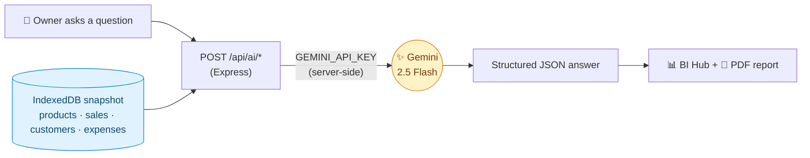
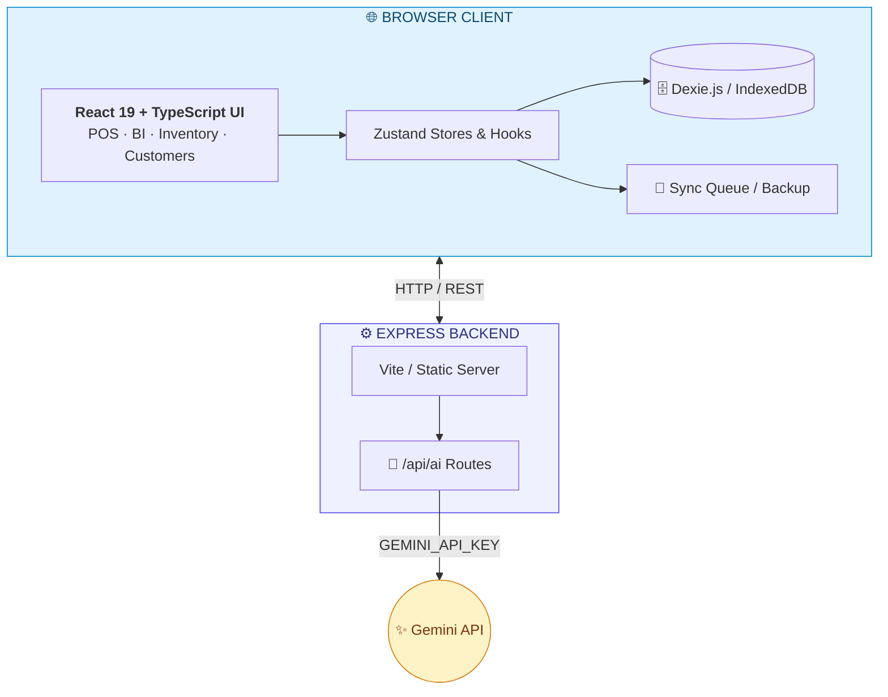
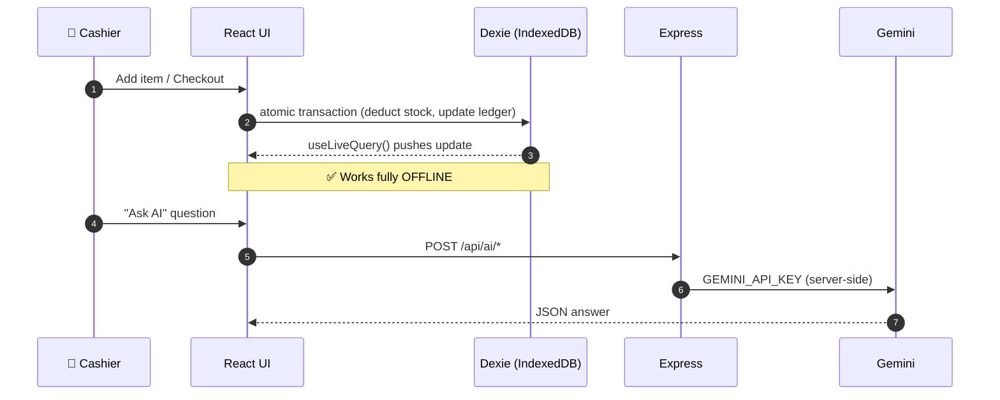
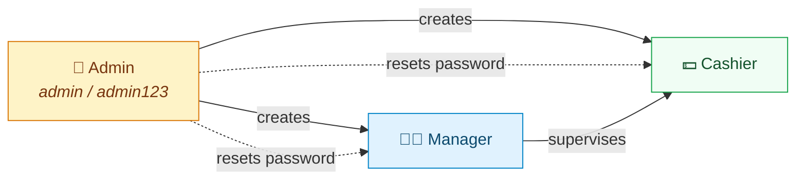

<!-- =====================================================================
     🏪  SMART SHOP MANAGEMENT SYSTEM — Premium README
     ---------------------------------------------------------------------
     ✅ Full project report (a–g): name/problem · live URL · features ·
        AI + prompt · stack · 3+ screenshots · run instructions

     🎨 BEFORE YOU PUBLISH — replace:
        1. 🔍 search "REPLACE_LIVE_URL" → your real deployed link
        2. 🖼️  swap the placehold.co screenshots with files in /assets
        3. 🤖 paste your exact prompt from src/services/AIReportService.ts
===================================================================== -->

<div align="center">


# 🏪 Smart Shop Management System

### *Offline‑First · AI‑Powered · Built for a Real Business*

An ultra‑fast, **offline‑first** Point‑of‑Sale terminal & **Business‑Intelligence** suite —
engineered with **React 19 · TypeScript · Tailwind v4 · Dexie.js · Express · Google Gemini AI**.

<br/>


<br/><br/>

<!-- ⚠️ REPLACE_LIVE_URL -->
[](https://smart-shop-pos.vercel.app)
[](https://github.com/dagaiakhtar-ship-it/Final---project-)

</div>

> [!IMPORTANT]
> ### 🔗 Live Application
> **➡️ [https://smart-shop-pos.vercel.app](https://smart-shop-pos.vercel.app)** <!-- ⚠️ REPLACE_LIVE_URL -->
>
> 🔑 **Login →** Username `admin` · Password `admin123`
> 📴 *Offline‑first: all data lives in your browser's IndexedDB. To run locally, jump to [Getting Started](#-getting-started).*

---

## 📊 At a Glance

<table>
<tr>
<td align="center" width="20%">📴<br/><br/><b>100%</b><br/><sub>OFFLINE-FIRST</sub></td>
<td align="center" width="20%">🤖<br/><br/><b>Gemini 2.5</b><br/><sub>AI ANALYTICS</sub></td>
<td align="center" width="20%">⚡<br/><br/><b>&lt;1s</b><br/><sub>UI RESPONSE</sub></td>
<td align="center" width="20%">🧩<br/><br/><b>6+</b><br/><sub>BUSINESS MODULES</sub></td>
<td align="center" width="20%">🔐<br/><br/><b>3</b><br/><sub>USER ROLES</sub></td>
</tr>
</table>

<br/>

<div align="center">

### 📖 The Story


Running a small retail shop is more challenging than it appears. Every day, business owners lose revenue in ways that are difficult to notice. A slow checkout can drive away customers during peak hours, delayed inventory tracking can leave shelves empty when demand is highest, and unmanaged customer credit can gradually become unpaid debt. At the same time, enterprise solutions like SAP and Oracle ERP are expensive, overly complex, and often depend on a reliable internet connection—something many small businesses cannot always rely on.

The **Smart Shop Management System** was created to solve these real-world challenges. It combines billing, inventory management, customer records, credit management, purchases, suppliers, expenses, reporting, and **AI-powered business analytics** into a single modern platform that is fast, intuitive, and **fully functional even without an internet connection**.

Instead of simply recording transactions, the system helps shop owners make smarter decisions. Built-in AI analyzes sales patterns, predicts inventory shortages, identifies top-selling products, monitors customer credit risk, and provides actionable business insights—all from one dashboard.

The result is an affordable, enterprise-inspired solution designed specifically for small and medium-sized businesses, allowing owners to work faster, reduce losses, and grow their business with confidence.

> [!NOTE]
> **Built by a Computer Science student for his own shop.** This project combines academic software engineering principles with practical experience gained from managing a real retail business, ensuring that every feature addresses genuine day-to-day operational challenges.


<table>
<tr>
<td width="50%">

**⚡ Why it's different**
- 🚀 Sub‑second UI on commodity hardware
- 📴 100 % offline — IndexedDB is the source of truth
- 🤖 Gemini‑powered BI assistant & report writer
- ⌨️ Hotkey‑first cashier workflow (F1–F9)
- 🧾 Pixel‑perfect thermal receipt printing
- 🔐 Role‑based access — Admin · Manager · Cashier

</td>
<td width="50%">

**🎯 Built for**
- 🏪 Retail & grocery shops
- ☕ Cafés & quick‑service counters
- 📦 Wholesale & credit‑based trade
- 📊 Owners who want *real* analytics
- 🌍 Regions with unreliable internet
- 👨‍💻 Students learning full‑stack dev

</td>
</tr>
</table>

<br/>

<div align="center">

### ✨ Core Features


</div>

<table>
<tr>
<td width="33%" valign="top">

**🛒 POS Cashier Terminal**
Live product grid, instant search, barcode scanner, favorites, dynamic tax & discount engine, multi‑payment settlement *(Cash · Card · Wallet · Credit)*, and automatic credit‑limit validation.

</td>
<td width="33%" valign="top">

**📊 BI & AI Analytics**
Ask questions in plain English. Gemini returns insights, stock alerts, projections & **auto‑generated PDF reports** with executive summaries.

</td>
<td width="33%" valign="top">

**📦 Inventory & Catalog**
SKU & barcode generation, cost vs. sell price, reorder thresholds, low‑stock warnings, and **atomic stock deduction** on checkout.

</td>
</tr>
<tr>
<td valign="top">

**👥 Customers & Credit**
Lifetime spend tracking, loyalty history, full credit ledger, payment logs, automatic credit‑limit enforcement, and loan‑recovery tracking.

</td>
<td valign="top">

**🚚 Suppliers & Purchases**
Supplier profiles, purchase orders, inventory intake tracking, and accounts‑payable records — all linked to stock movements.

</td>
<td valign="top">

**💰 Expenses & ☁️ Sync**
Categorized & recurring expenses with attachments. Offline queue, JSON/CSV backup, restore wizard, and data‑integrity verification.

</td>
</tr>
</table>

<br/>

<div align="center">

### 🤖 The AI Feature


</div>

The built‑in **"Shop Mind"** assistant turns live shop data into decisions, powered by **Google Gemini 2.5 Flash**:

- 💬 Answers plain‑English questions — *"Which products should I reorder this week?"*
- 🚨 Flags **low / out‑of‑stock items**, **dead stock**, **fast movers**, and **customers near their credit limit**
- 📈 Produces short **demand & revenue projections** with stated assumptions
- 📝 Writes **executive‑summary PDF reports** → `headline · key metrics · insights · risks · actions`

> [!TIP]
> 🔐 The AI **never touches the browser directly**. The client calls `/api/ai/*`, and the **Express server injects `GEMINI_API_KEY` server‑side** — so your key is never exposed.




<br/>

<div align="center">

### 📸 Screenshots


</div>

<!-- 🖼️  REPLACE placehold.co URLs with: assets/pos-terminal.png · dashboard.png · inventory.png · customers.png -->

<table>
<tr>
<td align="center" width="50%">


<br/><sub><b>① POS terminal</b> — live cart & multi‑payment checkout</sub>
</td>
<td align="center" width="50%">


<br/><sub><b>② BI dashboard</b> — KPIs, charts & AI insights</sub>
</td>
</tr>
<tr>
<td align="center">

<br/><sub><b>③ Inventory</b> — stock levels & reorder alerts</sub>
</td>
<td align="center">

<br/><sub><b>④ Customers</b> — credit ledger & payment history</sub>
</td>
</tr>
</table>

<br/>

<div align="center">

### 🏗️ Architecture


</div>

A **hybrid, client‑centric, offline‑first** design. The browser owns the data; Express only serves files, proxies AI calls, and guards secrets.





<br/>

<div align="center">

### 🛠️ Tech Stack


</div>

<div align="center">

**Frontend**


**Backend & Data**


**AI & Export**


</div>

| Layer | Choice | Why |
|-------|--------|-----|
| **UI** | React 19 + TypeScript + Tailwind v4 | Type‑safe, fast, consistent design |
| **State / Routing** | Zustand · React Router v7 | Lightweight stores, protected routes |
| **Local DB** | Dexie.js / IndexedDB | Offline‑first source of truth |
| **Server** | Express (Node 18+) | Static serving + secure AI proxy |
| **AI** | Google Gemini 2.5 Flash | Fast, cheap analytics & reports |
| **Alt. backend** | Java 17 + JDBC + SQL | Relational reference implementation |

<br/>

<div align="center">

### 🔐 Roles & Access


</div>

> [!WARNING]
> **Security:** Change the default password immediately after first login in any real deployment.

<div align="center">

| Role | Username | Password | Scope |
|:---:|:---:|:---:|:---|
| 👑 **Admin** | `admin` | `admin123` | Full access · User management · **Resets Manager & Cashier passwords** |
| 🧑‍💼 **Manager** | *(by Admin)* | *(by Admin)* | Inventory · Purchases · Reports · Customers |
| 💵 **Cashier** | *(by Admin)* | *(by Admin)* | POS · Sales · Customer lookup |

</div>

> 🔑 **Only the Admin** can create users and reset the passwords of Managers and Cashiers.



<details>
<summary><b>🔑 Full permission matrix</b></summary>

| Feature | 👑 Admin | 🧑‍💼 Manager | 💵 Cashier |
|---------|:---:|:---:|:---:|
| POS Terminal / Sales | ✅ | ✅ | ✅ |
| Customer Management | ✅ | ✅ | 👁️ View only |
| Inventory & Products | ✅ | ✅ | ❌ |
| Purchases & Suppliers | ✅ | ✅ | ❌ |
| Expenses | ✅ | ✅ | ❌ |
| BI Dashboard & Reports | ✅ | ✅ | ❌ |
| Cloud Sync & Backup | ✅ | ❌ | ❌ |
| User Management | ✅ | ❌ | ❌ |
| **Change Manager/Cashier Password** | ✅ | ❌ | ❌ |
| System Settings | ✅ | ❌ | ❌ |

</details>

<br/>

<div align="center">

### 🚀 Getting Started


</div>

**✅ Prerequisites** — Node.js ≥ `18.x` · npm ≥ `9.x` · a [Gemini API key](https://aistudio.google.com/apikey) · *(optional)* Java 17+

**① Clone & install**
```bash
git clone https://github.com/dagaiakhtar-ship-it/Final---project-.git
cd Final---project-
npm install
```

**② Configure environment**
```bash
cp .env.example .env
```
```env
GEMINI_API_KEY="your_google_gemini_api_key_here"
APP_URL="http://localhost:3000"
```

**③ Run the dev server**
```bash
npm run dev          # 🌐 open http://localhost:3000
```

**④ Login** → `admin` / `admin123`

> [!TIP]
> 🪟 **Windows:** double‑click `run.bat` or `Click here to run app as localhost.bat` for a one‑click start.

**📦 Production build**
```bash
npm run build        # vite build + esbuild server.ts → dist/server.cjs
npm start            # node dist/server.cjs  (serves on :3000)
```

> [!NOTE]
> ☁️ **To get your live URL:** deploy `dist/` to **Vercel / Netlify / Render**, set `GEMINI_API_KEY` in the host's env vars, then paste the URL into the **LIVE_DEMO** badge at the top.

<br/>

<div align="center">

### ⌨️ Keyboard Shortcuts


</div>

<div align="center">

| Key | Action | | Key | Action |
|:---:|--------|---|:---:|--------|
| `F1` | Quick product search | | `F8` | Open checkout modal |
| `F2` | Focus barcode scanner | | `F9` | Quick **cash** sale |
| `F3` | Select / add customer | | `Esc` | Close / clear |
| `F4` | Apply order discount | | | |

</div>

<br/>

<div align="center">

### 🎓 Related Project


</div>

<table>
<tr>
<td width="55%">

**🏛️ University Management System**

*The most ambitious project I have undertaken* — a large‑scale, multi‑campus university ecosystem under one unified roof.

| Module | Description |
|--------|-------------|
| 🎓 Students & Teachers | Profile & academic management |
| 📚 Classes & Attendance | Smart scheduling & real‑time tracking |
| 📊 Results & Degrees | Automated grading & degree issuance |
| 🔐 Admin & Super Admin | Multi‑tier institutional oversight |

<div align="center">

[**🔗 View on GitHub →**](https://github.com/dagaiakhtar-ship-it/Final-project-2-University-Management-system)

</div>

</td>
<td width="45%" align="center">

<a href="https://github.com/dagaiakhtar-ship-it/Final-project-2-University-Management-system">

</a>

</td>
</tr>
</table>

<br/>

<div align="center">

### 👨‍💻 Developer


<br/><br/>

**Akhtar Ali**

*Computer Science Student & Shopkeeper*

*Built for a real‑world shop — combining academic knowledge with practical business experience.*

<br/>


<br/><br/>

### 💙 Built with caffeine, TypeScript & a love for offline‑first design

**Smart Shop Management System** · by **Akhtar Ali**

<br/>

<sub>This project is developed for educational and practical use. ⭐ Star the repo if you find it useful!</sub>

</div>
